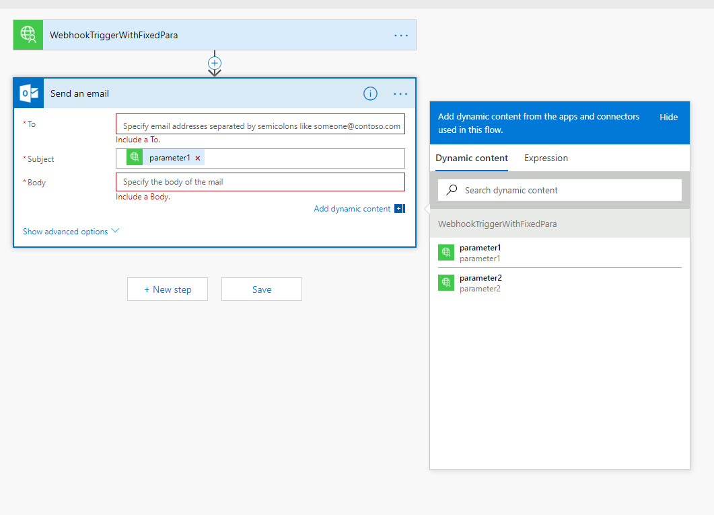
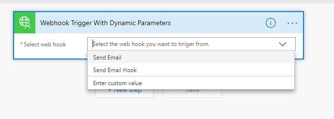

# Invoke Microsoft Flow (Microsoft Logic app) using custom connector with WebHook trigger
[Microsoft Flow](https://flow.microsoft.com/) can help automating repetitive tasks.
The Flow service already did a really well integration with a variety of applications and services,
e.g. sending Outlook email, sending tweet, reading Dropbox document and so on. Microsoft Flow can act
as a broker between your application and those applications. By doing so, it can elevate
the burden of building the integrations with different applications.

If you want to invoke Flow from your application, one simple way is to add the 'Request connector'
to a Flow. Then the Request connecter will expose a HTTP endpoint that you can use as RSET API call from
your application. [This blog](https://flow.microsoft.com/en-us/blog/call-flow-restapi/) provided a sample
about this. However, this requires the flow creator to manaully input the request schema in the 'Request connector'
and register the HTTP endpoint to your application. ['Custom connector'](https://docs.microsoft.com/en-us/connectors/custom-connectors/index)
can improve this procedure.

You can also invoke Flow from your application through a ['Custom connector trigger'](https://docs.microsoft.com/en-us/connectors/custom-connectors/index) you defined.
There are two tyoes of trigger: Polling and [Webhook](https://go.microsoft.com/fwlink/?LinkID=851044). This sample only focus on the Webhook trigger.

## File structure
### Sample web app
The solution ['src/FlowConnectorTrigger.sln'](https://github.com/weng5e/flow-connector-trigger/blob/master/src/FlowConnectorTrigger.sln) 
is the sample web app that integrates with Flow to invoke Flow's functionality. It is an Asp.Net Core 2.1 Web API application.
You can run the application in Visual Studio 2017 (requiring [.Net Core 2.1 SDK](https://www.microsoft.com/net/download/dotnet-core/2.1)).

### Sample custom connector OpenAPI definitions
The folder ['connector-definition'](https://github.com/weng5e/flow-connector-trigger/tree/master/connector-definition) contains the OpenAPI (Swagger) files
of several custom connectors.

## Webhook Trigger
In order to use the Webhook trigger, your application needs to provide a HTTP endpoint to MS Flow service to register the corresponding webhook callback endpoint, e.g. the [POST /api/v1/FlowConnector/hookId/{hookId}](https://github.com/weng5e/flow-connector-trigger/blob/7a7bd67e558005b4cc4aa8368b8fc695a7076dcd/src/SampleService/Controllers/FlowConnectorController.cs#L40) REST API in the sample code.
When a Flow user adds the custom connector to their flow, MS Flow will send a request to the endpoint with a dynamicly generated webhook url.
Then when your application wants to trigger the corresponding Flow action, you can invoke it by [sending a request to the registered webhook url](https://github.com/weng5e/flow-connector-trigger/blob/7a7bd67e558005b4cc4aa8368b8fc695a7076dcd/src/SampleService/Controllers/ExecutionController.cs#L81).

### Webhook with fixed schema
[Sample connctor OpenAPI definition](./connector-definition/5eBasicFixedParameter.swagger.json)

Your application and MS Flow need to agree on the Webhook Request Schema to determine the parameters sent in the webhook request. If the
parameters are fixed, you can [define them in the connector's OpenAPI definition using the "x-ms-notification-content"](https://github.com/weng5e/flow-connector-trigger/blob/7a7bd67e558005b4cc4aa8368b8fc695a7076dcd/connector-definition/5eBasicFixedParameter.swagger.json#L17)
property. The defined parameters in the schema will be available for flow users to choose in their flows, just like the following picture 
("parameter1" and "parameter2" will show up under the "Dynamic content" tab): 

### Webhook with dynamic schema
[Sample connctor OpenAPI definition](./connector-definition/5eDynamicParameter.swagger.json)

Besides the fixed schema, your connector can also [define an action to let MS Flow fetch the schema dynamicly](https://github.com/weng5e/flow-connector-trigger/blob/7a7bd67e558005b4cc4aa8368b8fc695a7076dcd/connector-definition/5eDynamicParameter.swagger.json#L16).
In the connector's OpenAPI definition, the "x-ms-dynamic-schema" property under "x-ms-notification-content" will instruct MS Flow
to retrieve the dynamic schema using [the action with the "operationId" you just defined](https://github.com/weng5e/flow-connector-trigger/blob/7a7bd67e558005b4cc4aa8368b8fc695a7076dcd/connector-definition/5eDynamicParameter.swagger.json#L46).

### Drop down for choosing Webhook Trigger
[Sample connctor OpenAPI definition](./connector-definition/5eAccessControl.swagger.json)

Within your application, sometimes it is useful to define multiple Flow triggers for different users.
When a user add the custom connector, the user will be able select the accessible triggers in your application
to register the webhook call back. You can even ease the process by providing a drop down list (as shown in the figure below).
In the [sample connector](https://github.com/weng5e/flow-connector-trigger/blob/7a7bd67e558005b4cc4aa8368b8fc695a7076dcd/connector-definition/5eAccessControl.swagger.json),
[an action for retrieving the accessible hook IDs](https://github.com/weng5e/flow-connector-trigger/blob/7a7bd67e558005b4cc4aa8368b8fc695a7076dcd/connector-definition/5eAccessControl.swagger.json#L16) is defined first.
Then it is [referenced in the "x-ms-dynamic-values" property by its "operationId" "GetAccessibleHookIDs"](https://github.com/weng5e/flow-connector-trigger/blob/7a7bd67e558005b4cc4aa8368b8fc695a7076dcd/connector-definition/5eAccessControl.swagger.json#L102).

## Reference
* [Github webhook trigger sample](https://docs.microsoft.com/en-us/connectors/custom-connectors/create-webhook-trigger)
* [Extend an OpenAPI definition for a custom connector](https://docs.microsoft.com/en-us/connectors/custom-connectors/openapi-extensions#x-ms-dynamic-values)